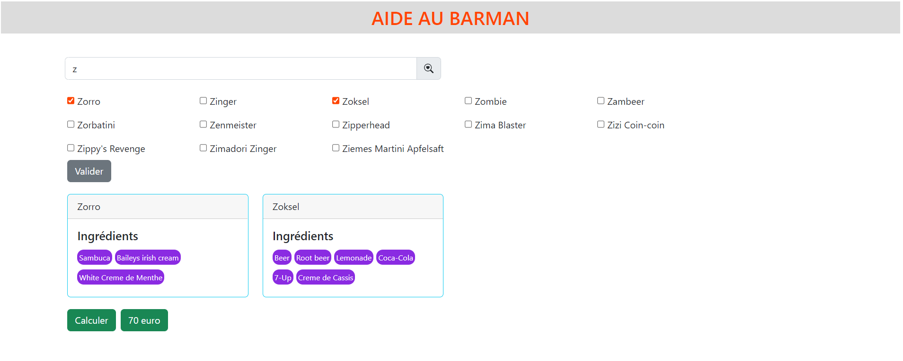

# Barman

## Priopriétés
Ce projet test  été créé avec  [Angular CLI](https://github.com/angular/angular-cli) version 14.1.3.
Angular CLI: 14.1.3
Node: 16.17.0
Package Manager: npm 8.15.0 
OS: win32 x64

## Utilisation

Nous proposons une interface graphique simple pour faire la recherche des cocktails afin de calculer le coût des ingrdients.

1. Siasissez un caractère puis faire la recherche en selectionnant la touche `Entrer`.
Le résultat affiché est l'ensemble des cocktails commençant par la lettre saisie. 
Si plus d'un caratère est saisie, l'application retournera que le(s) cocktail(s) avec le nom exacte.

2. Dans la liste des cocktails, faites vos choix, et valider par la touche `Entrer` encore une fois, ou en cliquant sur le bouton `Valider` de la page web.

3. Une fois le détails des cocktails est affiché, vous pouvez calculer le coût total des ingrédients.

## Development server

Run `ng serve` for a dev server. Navigate to `http://localhost:4200/`. The application will automatically reload if you change any of the source files.

